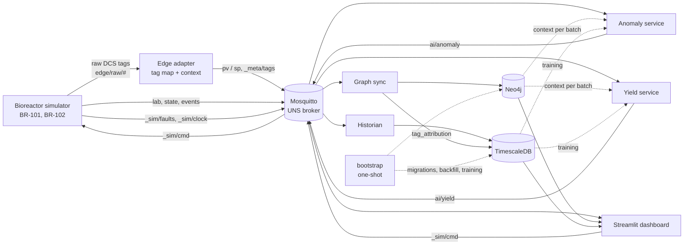
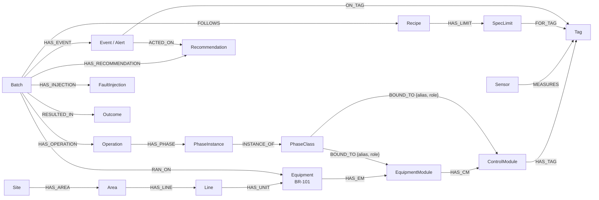

# Pharma 4.0 POC — Bioreactor UNS, Knowledge Graph & AI Architecture

Architecture reference for the pharma-4 POC. The decisions behind it are recorded in [docs/adr](adr/README.md). Last updated 2026-09-23.

> This revision reflects ADR-0009 to ADR-0014. Where it differs from the earlier revision, the ADR named in the section says why.

## Purpose & scope

The POC proves that one simulated fed-batch bioreactor can publish into a Unified Namespace, be modelled in a knowledge graph, and drive two AI use cases: live anomaly detection and batch yield optimization. It runs on one laptop with `docker compose up`, and reaches demo-ready without any manual steps.

**Questions the POC must answer with a live demo**

1. Can every sensor, setpoint, operation, phase and batch event live under one ISA-95 MQTT topic tree that any consumer can subscribe to?
2. Can a knowledge graph turn that stream into context: which batch, which equipment, which recipe, which phase controlled which loop, which spec limits?
3. Can a model flag a developing fault (for example a drifting pH probe or a fouling sparger) before the true process leaves spec?
4. Can a model predict final titer mid-batch and recommend setpoint changes that raise it, and only when the gain is real?

**In scope**

- One site, one area, two bioreactors (BR-101, BR-102), so the graph and UNS show more than one asset
- A Python simulator with a hidden true state, a sensor model, closed-loop control, injected faults and a titer outcome per batch
- Mosquitto broker, edge adapter, TimescaleDB history, Neo4j graph, anomaly and yield services, Streamlit dashboard
- 200 historical batches, generated automatically on first start

**Out of scope**

- Real PLC/OPC UA or PI connectivity (the simulator stands in; an OPC UA or PI adapter is a later swap)
- GMP validation, audit trail, e-signatures, user management
- Sparkplug B, MQTT clustering, TLS certificates
- Closed-loop control: the optimizer only recommends; a person applies

## Architecture overview

Everything goes through the MQTT broker. Producers publish once to the UNS, and every consumer subscribes independently. No service calls another service to fetch process data. The one sanctioned exception is the historical bulk loader (ADR-0010).



| Component | Technology | Role |
| --- | --- | --- |
| Simulator | Python, paho-mqtt, NumPy | True process state, sensor model, control loops, faults, batches, operations and phases; obeys `_sim/cmd` |
| Edge adapter | Python, paho-mqtt | Maps raw tags into the UNS, adds unit, batch and quality, applies the deadband, publishes `_meta/tags` |
| Broker | Eclipse Mosquitto 2.x | Single source of truth for current state; ACL per service |
| Historian | Python + TimescaleDB | Stores every scalar value, structured events and fault labels |
| Graph sync | Python + Neo4j driver | Maintains context; projects `tag_attribution` into TimescaleDB |
| Anomaly service | Python, scikit-learn, PyOD | Scores windows, manages the alert lifecycle |
| Yield service | Python, LightGBM, Optuna, SHAP | Mid-batch titer band, gated recommendations |
| Dashboard | Streamlit | Live views, alerts, yield, graph queries, UNS browser, Demo sidebar |
| Bootstrap | Python (one-shot) | Migrations, schema, config load, backfill, training — idempotent |

## Time model

(ADR-0009)

- `ts` is **simulated plant time**. The source stamps it and the edge adapter never restamps it. Deadband floor, feature windows, batch days and alert hysteresis all count in `ts`.
- Liveness is judged by **wall-clock** time. Every service publishes a retained `pharmaco/_meta/<service>/status` heartbeat every 30 s of wall-clock time, and registers an MQTT last-will of `offline`. Nothing compares `ts` with `now()`.
- The simulator integrates on a 5 s step and **publishes raw samples every 60 simulated seconds** by default (configurable; 5 s is sensible at 1×).
- **Speed** is set at runtime: pause, 1×, 60×, 600×, 3600×, or "run to day N, then pause". At 3600× a 14-day batch takes about 6 minutes and raw traffic is about 1.8k msg/s.
- The clock is **monotonic**. On start, sim time = `max(wall-clock now, latest ts in retained state/*)`.

## Simulated bioreactor process

The simulator models a 14-day CHO fed-batch run producing a monoclonal antibody. It keeps a **hidden true state** (cells, glucose, lactate, pH, DO, temperature, volume). A **sensor model** turns that into measured values (noise on every PV, offsets, stuck values), and **control loops** act on the *measured* values, as a real DCS does. Each batch ends with a titer in g/L, which is the yield target.

**Tags per bioreactor** (raw names follow ISA-5.1)

| Raw DCS tag | UNS topic | Unit | Typical value | Kind |
| --- | --- | --- | --- | --- |
| TIC-101.PV / .SP | `pv/temperature`, `sp/temperature` | °C | 36.5, shifting to 32–35 | PV + SP |
| AIC-102.PV / .SP | `pv/ph`, `sp/ph` | pH | 7.00 (6.90–7.10) | PV + SP |
| AIC-103.PV / .SP | `pv/do`, `sp/do` | % air sat. | 40 (30–50) | PV + SP |
| SIC-104.PV | `pv/agitation` | rpm | 80–140, cascades with DO | PV |
| FIC-106.PV | `pv/air_flow` | L/min | 0.1–2.0 | PV |
| FIC-107.PV | `pv/o2_flow` | L/min | 0–1.0, DO cascade | PV |
| FIC-108.PV | `pv/co2_flow` | L/min | 0–0.5, pH control (acid side) | PV |
| FQI-105.PV | `pv/feed_total` | L | bolus daily from day 3 | PV |
| FQI-109.PV | `pv/base_total` | mL | rising (pH control, base side) | PV |
| PIC-110.PV | `pv/pressure` | mbar | 50–100 | PV |
| WIT-111.PV | `pv/weight` | kg | 1,500 → 2,000 | PV |
| TI-199.PV | *(unmapped, spare RTD)* | — | — | — |
| *(LIMS)* | `lab/vcd` | 10^6 cells/mL | daily | Lab |
| *(LIMS)* | `lab/viability` | % | daily | Lab |
| *(LIMS)* | `lab/glucose`, `lab/lactate` | g/L | daily | Lab |
| *(LIMS)* | `lab/ph_offline` | pH | daily blood-gas check | Lab |
| *(LIMS)* | `lab/titer` | g/L | daily from day 5; final at harvest | Lab |

**Operations and phases** (ADR-0011). Operations run in sequence: Setup → Inoculation → Growth (day 0 to the shift) → TempShift → Production → Harvest. Within each operation, phases run **in parallel**: `TEMP_CTRL`, `PH_CTRL` (drives CO2 and the base pump), `DO_CTRL` (agitation, air, O2) and `FEED_ADD`. Each phase can be `RUNNING`, `HELD` or `COMPLETE`, and the simulator emits occasional HOLDs.

**Dynamics** (`simulator/process.py`). Cell growth follows a Monod/logistic model with glucose uptake, lactate production and consumption, and a lumped feed nutrient (amino acids) that specific productivity depends on. Final titer depends on the integral of viable cells, the temperature-shift day, the production temperature, the pH band held, DO stability and feed volume, plus per-batch variation in the cells. Each lever has a real interior optimum: too little feed starves productivity, too much raises osmolality and kills cells. Tests hold the optima inside the PARs (`tests/simulator/test_process.py`). `simulator.truth` exposes the ground-truth titer function for evaluating the optimizer.

**Batch outcomes.** `Batch.status` is `COMPLETE`, `ABORTED` or `EARLY_HARVEST`. The simulator applies explicit rules: contamination signature → ABORTED; viability below 60% → EARLY_HARVEST. An ABORTED batch has `titer = null` and `disposition = REJECTED`.

**Injected faults** (random, labelled on `_sim/faults`, ADR-0012)

| Fault | What the simulator does | What is observable | Why it matters |
| --- | --- | --- | --- |
| pH probe drift | Probe offset grows +0.02 pH/h; the loop holds the *measured* PV at SP, so the true pH falls. It ends when the next daily blood-gas check disagrees with the probe by more than 0.1 and the operator recalibrates | PV flat at SP; CO2 flow rising; base flat; `lab/ph_offline` diverges from PV | The PV looks perfect while the culture drifts |
| DO sparger fouling | Oxygen transfer coefficient decays to 4% (time constant 8 h) | Agitation climbs to max, O2 flow rises to max, DO still sags | Oxygen limitation cuts growth |
| Temperature control loss | Loop tuning degrades | Temperature oscillates ±0.8 °C | Stresses cells, lowers titer |
| Feed pump failure | Pump stops on a feed day | Feed total flat, weight flat, glucose falls next lab | Glucose depletes, viability falls |
| Stuck sensor | One analog PV repeats its exact last value for 24 h (until maintenance) | Bit-identical heartbeat values | Classic data-quality issue |
| Contamination (rare) | Foreign growth that consumes oxygen and makes acid | DO and pH drop together; the confirming sample at the abort shows the lactate spike | Batch loss (ABORTED) |

The stuck-sensor fault sets `q = UNCERTAIN` only when the simulator's device-side check happens to notice it, so the AI still has something to catch.

**Historical batches (200).** 100 per reactor at about 16 days each, including turnaround, so the history spans roughly mid-2022 to the day before first boot. Ids run `B2022-0000` … `B2026-0199`, and the first live batch is `B2026-0200` (ADR-0009). The history is designed so that the levers can be learned:

- **About 150 manufacturing batches** across three recipe versions (v1 → v3, a realistic process history), with small run-to-run jitter on each lever.
- **About 50 process-characterisation batches** (`campaign = PC`), from a Latin-hypercube design across the proven acceptable ranges, in two campaigns.
- **About 15% carry one fault.** Each batch's **actual lever values** are derived from its SP history and stored on the batch, not assumed from its recipe.

## MQTT broker & UNS design

The UNS follows the ISA-95 hierarchy Enterprise / Site / Area / Line / Cell. A tag's topic tells you what it is without a lookup table. Current state is retained on the broker.

**Topic tree**

```
pharmaco/                                   # enterprise
  chennai/upstream/suite-1/                 # site / area / line
    BR-101/                                 # cell (equipment)
      pv/temperature | ph | do | agitation | air_flow | o2_flow | co2_flow
         | feed_total | base_total | pressure | weight          (edge adapter)
      sp/temperature | ph | do                                   (edge adapter)
      lab/vcd | viability | glucose | lactate | ph_offline | titer   (simulator as LIMS)
      state/batch                           # current batch id
      state/operation                       # Growth, Production...
      state/phase/temp_ctrl | ph_ctrl | do_ctrl | feed_add   # RUNNING / HELD / COMPLETE
      events/batch                          # start, operation change, harvest, abort
      events/operator                       # manual setpoint changes
      ai/anomaly/score
      ai/anomaly/alert/<layer>-<tag|class>  # one retained topic per open alert
      ai/yield/prediction
      ai/yield/recommendation
    BR-102/ ...
  _meta/
    tags/<unit>/<class>/<name>              # raw tag, unit, kind, deadband (edge adapter)
    <service>/status                        # heartbeat + last-will, every service

edge/                                       # outside the UNS
  raw/BR101/BR101.AIC-102.PV                # raw DCS tags in
  unmapped                                  # dead letter for unknown tags

_sim/                                       # outside the UNS; does not exist in a real plant
  cmd/batch | fault | clock | setpoint      # demo control (dashboard, simulator.ctl)
  clock                                     # sim time and speed
  faults/<unit>                             # ground-truth labels
```

**Payload** (ADR-0002, ADR-0013). Every payload carries all six keys. `v` is typed per topic class in `common/models.py`: a float for `pv`, `sp`, `lab` and `ai/anomaly/score`; a string enum for `state/*`; a nested model for events, alerts and recommendations. `unit` is null where it does not apply. `src` is one of `sim`, `edge`, `anomaly`, `yield`, `operator`. `historian`, `graph-sync` and `dashboard` also exist, but only as the source of those services' own heartbeats. Commands on `_sim/cmd/*` carry `src = operator`, because a person issues them.

```json
{ "v": 7.03, "ts": "2026-09-22T10:15:05.000Z", "unit": "pH",
  "q": "GOOD", "batch": "B2026-0142", "src": "edge" }
```

```json
{ "v": { "id": "A-7f3c", "state": "OPEN", "layer": "stats",
         "score": 4.2, "threshold": 3.0, "fault_class": "ph_probe_drift",
         "top_tags": ["co2_flow", "base_total", "ph"],
         "opened_at": "2026-09-24T03:10:00Z" },
  "ts": "2026-09-24T03:10:00Z", "unit": null, "q": "GOOD",
  "batch": "B2026-0200", "src": "anomaly" }
```

**Broker settings**

| Topic class | QoS | Retain | Reason |
| --- | --- | --- | --- |
| `pv/*`, `sp/*` | 0 | yes | High rate; latest value is what matters |
| `lab/*`, `state/*`, `_meta/*` | 1 | yes | Low rate, must not be lost |
| `events/*`, `_sim/cmd/*`, `_sim/faults/*` | 1 | no | Event streams; history lives in the DB and graph |
| `ai/anomaly/alert/*`, `ai/yield/recommendation` | 1 | yes | The open set; cleared with an empty retained message |
| `ai/anomaly/score`, `ai/yield/prediction` | 0 | yes | Latest value is what matters |
| `edge/raw/*` | 0 | no | Raw stream into the adapter |
| `edge/unmapped`, `_sim/clock` | 1 | yes | A browser always shows the latest one |

This table lives in code as `common.uns.delivery()`.

**ACL** (allowlist; every service has its own user; source of truth: `mosquitto/acl`, checked by `tests/test_acl.py` and, against the live broker, `tests/test_broker.py`)

| User | Write | Read |
| --- | --- | --- |
| simulator | `edge/raw/#`, `…/lab/#`, `…/state/#`, `…/events/#`, `_sim/clock`, `_sim/faults/#`, `_meta/simulator/#` | `_sim/cmd/#`, `…/state/#` |
| edge-adapter | `…/pv/#`, `…/sp/#`, `edge/unmapped`, `_meta/tags/#`, `_meta/edge-adapter/#` | `edge/raw/#`, `…/state/batch` |
| historian | `_meta/historian/#` | `pharmaco/#`, `_sim/faults/#` |
| graph-sync | `_meta/graph-sync/#` | `pharmaco/#` (pv unused), `_sim/faults/#` |
| anomaly | `…/ai/anomaly/#`, `_meta/anomaly/#` | `pharmaco/#` — **no `_sim/#`** |
| yield | `…/ai/yield/#`, `_meta/yield/#` | `pharmaco/#` — **no `_sim/#`** |
| dashboard | `_sim/cmd/#`, `_meta/dashboard/#` | `pharmaco/#`, `edge/#`, `_sim/clock`, `_sim/faults/#` |
| healthcheck | — | `$SYS/#` (compose healthcheck only) |
| explorer | — | `#` (a person with MQTT Explorer; never a service) |

Heartbeat topics use the compose service name: `pharmaco/_meta/<service>/status`, so the edge adapter's is `_meta/edge-adapter/status`.

**Rules that keep the UNS clean**

- Only the owner of a node publishes to it (see ACL). If a publish needs a new branch, update the ACL in the same change.
- Consumers subscribe with wildcards, for example `pharmaco/+/+/+/+/pv/#` for all live process values.
- Topic names are lowercase and stable. Units and limits live in `_meta`, not in the name. Topics are built only through `common/uns.py`.

## Edge adapter

The edge adapter sits between the "plant" and the UNS and does the contextualisation a real site would need (ADR-0005). It is a small Python service, not a low-code flow (ADR-0003). Its logic is pure functions (`map_and_enrich`, `deadband`), so backfill can call them without a broker (ADR-0010).

**What goes through the adapter and what doesn't**

- **Through the adapter:** process values and setpoints (`pv/*`, `sp/*`).
- **Direct to UNS:** `lab/*`, `state/*`, `events/*`, published by the simulator standing in for LIMS and MES.
- **Not in the adapter:** fault detection, graph sync, anomaly and yield logic.

**Raw input.** `edge/raw/BR101/<tag>`, flat payload: `{"tag":"BR101.AIC-102.PV","value":7.03,"t":"2026-09-22T10:15:05.000Z","q":"GOOD"}`. `q` is the DCS status bit, which the adapter carries into the UNS `q`.

**Tag map.** `edge/tag-map.yaml` is authored as an independent commissioning artifact. The simulator has its own DCS configuration, `simulator/dcs_tags.yaml`. A coverage test asserts that every simulator tag is mapped, except those on an explicit `expected_unmapped` list. `TI-199.PV` (a spare RTD) ships unmapped on purpose, so `edge/unmapped` always has something to show.

**Pipeline.** Parse → look up → enrich with unit, current batch (from retained `state/batch`) and quality → deadband → publish retained. `v` is never rounded. On start and on map change, the adapter publishes retained `_meta/tags/*` from the map.

**Deadband.** Publish when the value moves beyond the per-tag deadband, or when the floor interval (default 10 simulated minutes) has elapsed since the last publish. The floor must exceed the raw publish period, or the adapter refuses to start (ADR-0009).

**Swap path.** For a real plant only the input changes: an OPC UA client or a PI Web API poller replaces the `edge/raw/#` subscription.

## Knowledge graph

Neo4j holds context and relationships, never the raw time series (ADR-0004).

**Schema**



| Node | Key properties | Source |
| --- | --- | --- |
| Site, Area, Equipment, EquipmentModule, ControlModule, Sensor | ISA-95 path, name, type; sensor model and calibration due | `config/plant.yaml` |
| PhaseClass, `BOUND_TO` | name; alias, role (`control` / `monitor`) | `config/plant.yaml` (FHX stand-in) |
| Tag | UNS topic, raw tag, unit, kind | `_meta/tags/*` |
| Recipe, SpecLimit | version; PAR / action / alarm low–high per tag or lever | `graph/recipes/*.yaml` |
| Batch | id, start, end, status, campaign, planned and actual levers (shift day, production temp, pH SP, DO SP, feed multiplier) | `events/batch` (planned), `events/operator` (changes) |
| Operation | name, start, end | `state/operation` |
| PhaseInstance | start, end, state intervals (RUNNING / HELD) | `state/phase/*` |
| Event | id, type, severity, ts, layer, score, state | `events/*`, `ai/anomaly/alert/*` |
| Recommendation | id, levers current → recommended, gain P10/P50 | `ai/yield/recommendation` |
| FaultInjection | fault, onset, end — **never an `:Event`** | `_sim/faults/*` |
| Outcome | final titer, disposition, harvest day, peak VCD, viability | `lab/*` at harvest, `events/batch` |

**Sync.** graph-sync subscribes to `_meta/tags`, `events`, `lab`, `ai/anomaly/alert`, `ai/yield/recommendation` and `_sim/faults`, but never `pv` or `sp`. Batch structure comes from `events/batch`, which carries every operation and phase transition, so `state/*` is not needed. It `MERGE`s by natural key, so replays are idempotent. That comes to about 30 nodes per batch before alerts.

**Replay** (`graph/replay.py`). The historian keeps every message graph-sync consumes (`uns_events` in arrival order, lab values in `tag_values`, labels in `fault_labels`), so the graph can be rebuilt from TimescaleDB through the same core. Bootstrap uses this after backfill and replays any batch the graph lacks, so a Neo4j reset heals itself. `python -m graph.replay --all` rebuilds everything.

**Actual levers** (`common/levers.py`) are the planned levers from `BATCH_START` updated by each `events/operator` change, not reconstructed from setpoint history. graph-sync and yield training use the same function.

**Attribution projection** (ADR-0011). `graph/project.py` resolves ADR-0006's algorithm and upserts `tag_attribution(topic, batch_id, operation, phase, role, phase_state, t_start, t_end)` into TimescaleDB. It runs whenever an operation or phase interval closes or changes, and in bulk from backfill. A null `phase` means the fallback to the operation.

**Example queries the demo will run**

```cypher
// Alerts on low-titer batches, grouped by tag (aborted batches separately)
MATCH (b:Batch)-[:RESULTED_IN]->(o:Outcome)
WHERE o.titer < 3.0
MATCH (b)-[:HAS_EVENT]->(e:Event {type:'alert'})-[:ON_TAG]->(t:Tag)
RETURN t.name, count(e) AS alerts ORDER BY alerts DESC;

// Which phase controls, and which only watches, the pH PV on BR-101
MATCH (pc:PhaseClass)-[b:BOUND_TO]->()-[:HAS_CM*0..1]->(:ControlModule)-[:HAS_TAG]->(t:Tag {topic:$ph_topic})
RETURN pc.name, b.role, b.alias;

// Advice → action → outcome
MATCH (b:Batch)-[:HAS_RECOMMENDATION]->(r:Recommendation)<-[:ACTED_ON]-(e:Event)
MATCH (b)-[:RESULTED_IN]->(o)
RETURN b.id, r.gain_p50, e.new_value, o.titer;

// Actual levers versus outcome, by campaign
MATCH (b:Batch)-[:RESULTED_IN]->(o) WHERE b.status <> 'ABORTED'
RETURN b.campaign, b.shift_day, b.ph_sp, avg(o.titer), count(b);
```

**How the AI uses the graph** (ADR-0011). Live state comes from retained UNS `state/*`. Spec limits, PARs, recipe and bindings are read from Neo4j once per batch, on `events/batch` start. Training reads only TimescaleDB plus `tag_attribution`.

## AI: anomaly detection

Three layers, from simple and explainable to learned and multivariate (ADR-0014).

| Layer | Method | Catches | Explainability |
| --- | --- | --- | --- |
| 1. Rules | Spec limits from the graph; rate-of-change; stuck value = 3 consecutive published values with bit-identical `v` (about 30 simulated minutes, given the deadband floor) | Out-of-spec values, stuck sensors | Exact: the rule that fired |
| 2. Univariate statistics | EWMA / CUSUM per tag, per operation — including CO2 flow and PV − `ph_offline` | Slow drift (pH probe) before the true value breaches | Which tag, how many sigmas |
| 3. Multivariate | PCA with Hotelling T² and SPE; Isolation Forest beside it | Relationship breaks: agitation at max while DO sags | Top contributing tags (SPE contributions) |

**Features** (`ai/features.py`, one function for both training and live scoring). Raw deadbanded values are resampled to a 1-simulated-minute grid with last-observation-carried-forward. 30-minute windows, advanced every 5 minutes, produce: mean, slope and std of each PV; PV − SP error; base, feed and CO2 rates from cumulative totals; agitation-to-DO ratio; time since the last feed bolus; operation; batch age. A parity test asserts that training and live produce identical features.

**Batch-evolution alignment.** A culture changes all the time, so each feature is centred and scaled by its mean and std **for clean batches at the same batch age** (1-h bins), per operation, before PCA and Isolation Forest see it.

**Suppression.** Layers 2–3 are suppressed for TempShift ±2 h, and for tags whose controlling phase is `HELD` (role and state from `tag_attribution` or the live `state/phase/*`). Layer 1 always runs.

**Training.** On clean historical batches only, one model per operation. Thresholds at the 99th percentile of training scores.

**Alerts** (ADR-0013). Keyed `ai/anomaly/alert/<layer>-<tag|class>`. An alert opens after 2 consecutive windows over threshold and clears after 4 under. It carries the score, layer, top 3 contributing tags and a suggested fault class. graph-sync keeps one Event per alert id.

**Evaluation** against `fault_labels` (never visible to the service):

- Detection rate per fault type
- Lead time: alert open versus the simulator's true spec-breach time
- False alerts per clean batch (target below 1), counting one lifecycle as one alert

## AI: yield prediction & optimization

Advisory only (ADR-0014).

**1. Mid-batch titer prediction**

- **Model:** LightGBM, with a PLS regression baseline. A 20-member bootstrap ensemble gives the point estimate and paired gains; quantile models give the displayed P10/P50/P90.
- **Training rows:** one per batch per day (days 3–12), excluding ABORTED batches. Features = trajectory summaries up to day d (integral of VCD, mean pH and temperature per operation, DO stability, cumulative feed and base, alerts so far — alerts, never labels) + the batch's **actual whole-batch lever values** + planned harvest day.
- **Output:** `ai/yield/prediction` every 6 simulated hours.
- **Evaluation:** RMSE and MAPE on held-out batches by batch day; the band should narrow as the batch progresses.

**2. Setpoint optimization**

- **Levers:** temperature-shift day (4–7), production temperature (32–35 °C), pH SP (6.90–7.10), DO SP (30–50%), feed multiplier (0.8–1.2). Bounds come from the recipe's PARs in the graph.
- **Frozen versus open:** a lever whose window has passed (for example the shift day once it has happened) is fixed at its actual value; Optuna TPE searches only the open levers, using the ensemble as surrogate.
- **Gate:** publish only if the ensemble's paired gain has P10 > 0 **and** median ≥ 0.1 g/L. Otherwise clear the retained recommendation.
- **Output:** `ai/yield/recommendation`, with current versus recommended values per lever, gain P10/P50/P90 and model version.
- **Known limitation:** a mid-batch change to an open lever is approximated by the whole-batch value the model was trained on.
- **Ground-truth check:** offline, `simulator.truth` scores how close the recommended levers get to the true optimum.

**3. Acting on advice.** There is no Apply button. The operator uses the dashboard's **DCS console** (a `_sim/cmd/setpoint` stand-in), optionally citing the recommendation id. The simulator emits `events/operator`, and the graph links the action to the recommendation (ADR-0012).

**4. Batch-level learning.** SHAP values rank which levers drive titer across all batches, shown beside the graph query linking levers to outcome by campaign. That is the process-understanding story that Quality by Design asks for.

**Honest limits.** The simulator has a known ground-truth yield function, so optimizer quality is measurable here. Real plants will need far more batches, and a designed experiment is still the proper way to move a validated setpoint.

## Storage, dashboard & service layout

One `Dockerfile` and one Python image. Each Python compose service runs a different `python -m …`, with its own MQTT user. It needs roughly 4 GB RAM.

| Service | Image / base | Ports | Depends on |
| --- | --- | --- | --- |
| mosquitto | eclipse-mosquitto:2 | 1883 | — |
| timescaledb | timescale/timescaledb:latest-pg16 | 5432 | — |
| neo4j | neo4j:5-community | 7474, 7687 | — |
| bootstrap (one-shot) | pharma-4 | — | timescaledb, neo4j |
| simulator | pharma-4 | — | mosquitto |
| edge-adapter | pharma-4 | — | mosquitto |
| historian | pharma-4 | — | mosquitto, timescaledb |
| graph-sync | pharma-4 | — | mosquitto, neo4j, timescaledb |
| anomaly | pharma-4 | — | mosquitto, bootstrap ✓ |
| yield | pharma-4 | — | mosquitto, bootstrap ✓ |
| dashboard | pharma-4 + Streamlit | 8501 | all |

✓ = `service_completed_successfully`.

**Bootstrap** (ADR-0010) is idempotent. It applies migrations and `schema.cypher`, loads `config/plant.yaml` and the recipes, runs backfill if `tag_values` is empty (in-process, no broker), and trains if the `models` volume lacks artefacts for the current data hash. A fixed seed makes it reproducible.

**Repo layout**

```
pharma-4/
  docker-compose.yml  Dockerfile  .env.example
  mosquitto/  mosquitto.conf, acl, passwd (generated from env)
  config/     plant.yaml (hierarchy, modules, phase classes, bindings)
  common/     uns.py, models.py, mqtt.py (incl. heartbeat + last-will)
  simulator/  process.py (true state), sensors.py, control.py, faults.py,
              batches.py, clock.py, truth.py, dcs_tags.yaml, run.py, ctl.py, backfill.py
  edge/       adapter.py, tag-map.yaml
  historian/  writer.py, migrations/*.sql
  graph/      sync.py, project.py, schema.cypher, recipes/*.yaml
  ai/         features.py
              anomaly/ (rules, ewma, mspc, iforest, alerts, service)
              yield_/ (train, predict, optimize, service)
              train_all.py
  bootstrap/  run.py
  dashboard/  app.py
  notebooks/  eda.ipynb, model_eval.ipynb
  tests/
```

(`yield` is a Python keyword, so the package is `yield_`.)

**TimescaleDB**

- `tag_values(ts, topic, batch_id, value, quality)`: hypertable for every scalar `v`
- `tag_values_1m`: continuous aggregate, **for dashboard charts only**. Real-time mode; only the last 30 days are materialised, older history is aggregated at query time from the compressed raw data
- `uns_events(ts, topic, batch_id, payload jsonb)`: structured messages (events, alerts, recommendations)
- `tag_attribution(...)`: projected by graph-sync
- `fault_labels(id, cell, batch_id, fault, onset, end, params)`: ground truth, for evaluation only
- `bootstrap_state(key, value)`: what the one-shot bootstrap has done (backfill end instant, completion)

**Dashboard pages**

1. **Live**: tag trends per bioreactor with SP overlay; current operation and phase states
2. **Alerts**: open alerts with contributing tags; T² / SPE charts
3. **Yield**: predicted titer band over batch days, current recommendation, SHAP drivers
4. **Graph**: preset Cypher queries, batch genealogy, phase bindings
5. **UNS browser**: live topic tree, including `edge/raw` and `edge/unmapped`

**Demo sidebar** (every page): start batch, inject or clear a fault, speed and pause, run to day N, and the **DCS console** for manual setpoint changes.

## Testing

- **Unit:** topic builder, payload models per topic class, tag-map coverage, deadband, clock monotonicity, projection against hand-built bindings, feature parity.
- **Fault harness** (`@pytest.mark.slow`, target under 60 s, runs by default in CI): a session fixture simulates about 30 clean batches in-process with fixed seeds and fits the anomaly models. Then, for **every fault type**, a seeded batch must open an alert of the expected layer and class **before the simulator's true spec-breach time**. A clean batch must produce fewer than 1 alert.
- **Compose smoke** (`-m compose`): brings up the stack, starts a batch through `_sim/cmd`, and asserts values reach TimescaleDB and Neo4j.

## Pharma 4.0 / GMP considerations

The POC deliberately skips validation, but its design mirrors what a GMP version would need. Each shortcut has a named upgrade path.

| Area | POC shortcut | What production needs |
| --- | --- | --- |
| Data integrity (ALCOA+) | Source timestamp and `src` on every payload; no audit trail | Immutable audit trail, time sync (NTP/PTP), 21 CFR Part 11 / EU Annex 11 controls |
| Data source | Python simulator | OPC UA from the DCS, or the PI Integrator / PI Web API bridging into MQTT |
| Broker | Single Mosquitto, password + ACL | Clustered HiveMQ or EMQX, TLS with client certificates, Sparkplug B or a governed JSON schema |
| Computerized system validation | None | GAMP 5 risk-based CSV; URS, IQ/OQ/PQ for GxP-impacting parts |
| AI models | Retrained by bootstrap on a data hash | Model lifecycle control: versioned data and models, drift monitoring, change control per GAMP 5 AI guidance |
| Recommendations | DCS-console stand-in, operator cited | Operator review and e-signature before any setpoint change; setpoints only within the PAR |
| Network | One Docker network | Purdue-model segmentation; the UNS lives in the DMZ or level 3, with no inbound writes to control |

**Keep the AI out of GxP decisions at first.** Anomaly alerts and yield advice work as decision support. Batch release still follows the approved process.

## Build plan & demo

Five increments, each ending with something demoable.

| # | Increment | Demo at the end |
| --- | --- | --- |
| 1 | Compose skeleton; `common/` (topics, typed models, heartbeat + last-will); simulator with true state, sensor model, control loops, clock and `_sim/cmd`, operations and phases; edge adapter with tag map, coverage test and `_meta/tags`; ACL | Raw tags in, contextualised UNS out; the spare RTD lands in `edge/unmapped`; pause and speed from the CLI |
| 2 | Historian, migrations, `bootstrap` with in-process backfill (recipe versions + PC campaign) | `docker compose up` from clean to 200 batches; trends per batch; titer spread by recipe version and campaign |
| 3 | `config/plant.yaml`, graph-sync, recipes, attribution projection, fault labels | Genealogy; "which phase controls pH vs only watches it"; attribution rows with roles |
| 4 | Features, anomaly layers 1–3 with alignment and suppression, alert lifecycle, fault harness, evaluation notebook | Inject pH probe drift live: the PV stays perfect, the CO2 EWMA alert fires before the true pH breaches; DO fouling with PCA contributions |
| 5 | Yield ensemble and quantiles, optimizer with frozen/open levers and paired gate, DCS console, SHAP, dashboard Demo sidebar | Mid-batch band narrows; recommendation with gain; operator applies it; graph links advice → action → outcome |

**Parked increments** (not planned; recorded so they are not lost)

- 6 — LLM Q&A over the graph and history (read-only, advisory), for example "why was batch 142 low?"
- 7 — PI Web API-shaped endpoint on the simulator, plus a second edge input, to show the ADR-0005 swap path
- 8 — Downstream area (harvest / chromatography) with cross-area batch genealogy

TimescaleDB stays (ADR-0004). InfluxDB is only revisited if a client's stack requires it.

**Demo script (about 10 minutes)**

1. Open the UNS browser: one namespace, every tag under its equipment path; `edge/raw` → UNS before-and-after, with the spare RTD in `edge/unmapped`.
2. Start batch B2026-0200 on BR-101 from the Demo sidebar, at 3600×. Show live trends and the operation and phase states.
3. Inject pH probe drift. The pH PV stays at 7.00, yet the EWMA on CO2 demand opens an alert, and the next `ph_offline` confirms it — hours before the true pH leaves the band. The alert appears as an Event in the graph.
4. Run "alerts on low-titer batches by tag" to show that pH issues correlate with low yield.
5. Run to day 4, then pause. Show the titer band and a recommendation (for example, shift on day 5 to 33 °C, with its gain). In the DCS console, the operator applies it, citing the recommendation. Resume, and watch the band move.
6. Close with the SHAP drivers and the advice → action → outcome graph query: process understanding, not just a black box.
